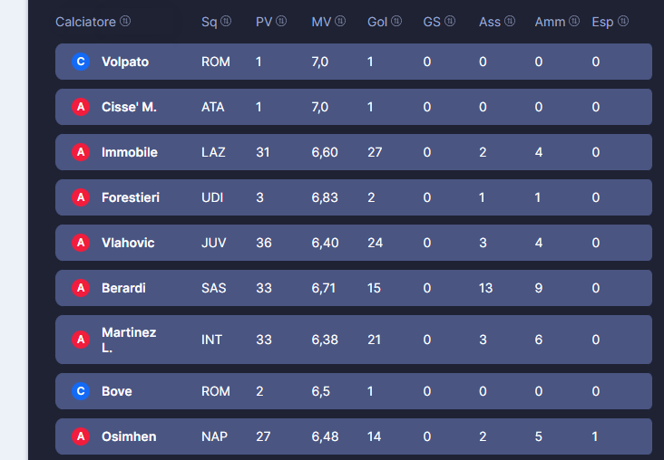
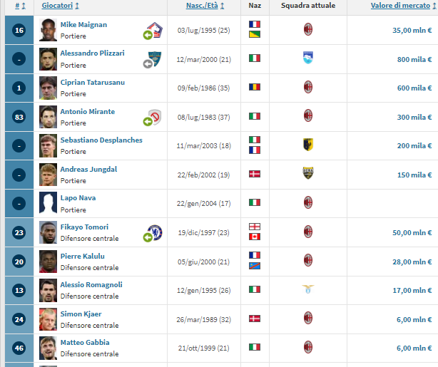
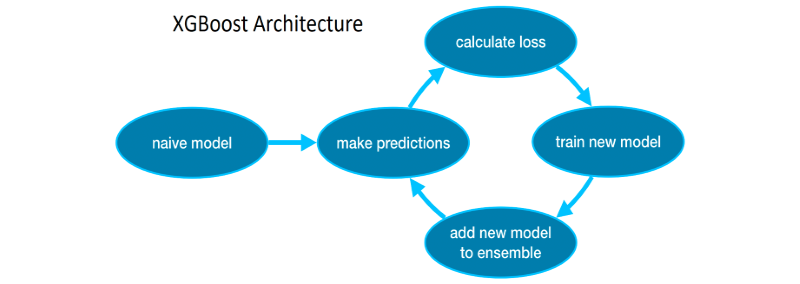

# Market Value Predictor
### __Introduction__ 
We aim to build a model that can predict the market value of football players. Such a tool could be useful for football clubs. In particular, it would allow them to make offers that reflect the real value of the player, avoiding overvaluation. The model is designed to estimate the value of professional players, i.e., those who have already played at least one professional season. Indeed, if we wanted to estimate the value of a young player, we would not have the data on which the model was trained, so it would not know how to infer knowledge.
### __Data__  
The market value (MV) will be influenced by the following characteristics:
1. Age 
2. Role 
3. Team he is part of 
4. Matches played
5. Average rating assigned by the [Alvin482](https://euroleghe.fantacalcio.it/voto-statistico-alvin) algorithm of Fantacalcio.it 
6. Goals scored 
7. Goals conceded (only concerns goalkeepers) 
8. Penalties saved (only concerns goalkeepers) 
9. Penalties conceded 
10. Assists
11. Yellow cards
12. Red cards 
13. Own goals

The data refers to the 2021/22 season. The __Age__ and __MV__ features were extracted from [Transfermarkt.it](https://www.transfermarkt.it/serie-a/startseite/wettbewerb/IT1/plus/?saison_id=2021). All other features were extracted from [Fantacalcio.it](https://www.fantacalcio.it/statistiche-serie-a/2021-22/fantacalcio/riepilogo). The __Surname__ attribute was used to merge the two datasets, i.e., to join the characteristics of each player into a single record.    Example of Fantacalcio.it's data :      Example of Transfermarkt.it's data:     
### __Proposed Method__ 
Two approaches are used: Polynomial Regression with Regularization and eXtreme Gradient Boost Regression    Source : [https://www.kaggle.com/code/alexisbcook/xgboost](https://www.kaggle.com/code/alexisbcook/xgboost)  
### __Results__
1. **Ridge Reggressor**; Through _cross-validation_, we obtain that the best value for the _alpha_ hyperparameter that regulates the flexibility of the model is: __18.2__. The _Mean Squared Error_ on the training set is: __3417411.0__, about 3.5 million €. The _Mean Squared Error_ on the test set is: __5209963.7__, about 5.2 million €.
2. **eXtreme Gradient Boost Regressor**. Through a random search, I noticed that the best value for the _learning rate_ hyperparameter is: __0.007__. By setting _early-stopping-rounds = 5_ I say that the algorithm stops iterating, i.e., stops adding models, if the loss function does not improve for 5 consecutive iterations. The _Mean Squared Error_ on the training set is: __1628561.9__, about 1.6 million €. The _Mean Squared Error_ on the test set is: __4107904.0__, about 4.1 million €.
### __Conclusions__
The XGBoost Regressor is the best at predicting the market value of footballers.

# Role-based Clustering
We want to divide football players into groups. Each group corresponds to a role. After making such a division, useful information can be extracted such as for example the average value of defenders, the average age of goalkeepers, the striker with the highest market value and much more.
### __Data__
The same as in the previous model.
### __Proposed Method__
K-Means.
### __Results and Conclusions__
Silhouette score on Training Set :  0.671 . Silhouette score on Test Set :  0.736 . 

## Please consult the [code](./SMM's%20project.ipynb) to see my implementation and feel free to make improvements